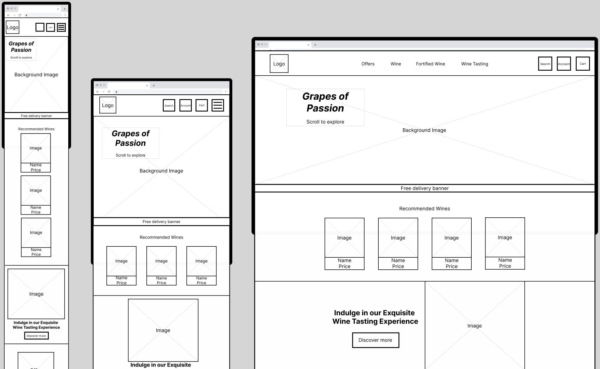
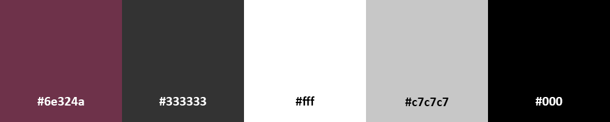

# Grapes of Passion

Website to be created for a fictional independent wine seller focused on enhancing the wine-buying experience with a user-friendly online platform. The website will offer easy navigation, detailed product listings, and secure shopping capabilities, ensuring an easy browsing and purchasing experience. Aiming to create a seamless and enjoyable way for consumers to explore and buy a selection of wines or book relevant experiences.

### [View the live project here](https://grapes-of-passion-37a9373e50d5.herokuapp.com/)

## User Experience (UX)

### User Stories

#### _Viewing/Navigation and Searching_

| #   | As a User/Shopper I want to be able to...                 |
| --- | --------------------------------------------------------- |
| 1   | Navigate around the site by scrolling.                    |
| 2   | Navigate through categories and subcategories.            |
| 3   | View products.                                            |
| 4   | View available offers.                                    |
| 5   | Search for specific queries relating to products.         |
| 6   | View imagery and relevant information about each product. |
| 7   | See the total amount of products in my basket.            |
| 8   | Filter to refine results for product/query.               |
| 9   | Sort products depending on preference.                    |
| 10  | View contact information and social media links.          |
| 11  | Book dates for events and specify any requirements.       |

#### _Checkout/Payment Processing_

| #   | As a User/Shopper I want to be able to...                                 |
| --- | ------------------------------------------------------------------------- |
| 12  | View the grand total and list of the products to check before purchasing. |
| 13  | Remove/or adjust quantity of items in the basket.                         |
| 14  | Trust my personal and payment information kept secret and secure.         |
| 15  | Receive an email confirmation if checkout is succesful.                   |

#### _Managing Accounts_

| #   | As a User/Shopper I want to be able to...       |
| --- | ----------------------------------------------- |
| 16  | Register for an account.                        |
| 17  | Receive an email confirmation.                  |
| 18  | Login and logout of my account.                 |
| 19  | Recover password if forgotten.                  |
| 20  | Add default delivery information in my profile. |
| 21  | View my order history.                          |

#### _Site Owners/Admins_

| #   | As a Site Owner/Admin I want to be able to...                                 |
| --- | ----------------------------------------------------------------------------- |
| 22  | Create products to including relevant details to be stored within a database. |
| 23  | View products displayed throughout the site.                                  |
| 24  | Manage these products so I can update and delete.                             |
| 25  | View a warning if deleting an item to prevent accidental deletions.           |

## Design

### Strategy

The strategy for this site is to include a wide range of features that users would expect for this type of website, as identified in the research below. I will also incorporate a darker, more passionate design to capture the company's essence and help it stand out from competitors.

#### Sites Researched:

-   [Averys](https://averys.com/)
-   [Laithwaites](https://www.laithwaites.co.uk/)
-   [The Great Wine Co.](https://greatwine.co.uk/)
-   [Kask](https://www.kaskwine.co.uk/)
-   [Cave Bristol](https://www.cavebristol.co.uk/)

#### General Findings:

-   Logos are typically in the top left, with a search function and basket icon in the top right.
-   Navigation includes dropdown menus for categories such as; Offers, Wine, Mixed Cases, Champagne & Sparkling, Subscriptions/Clubs, Gifts, About/About Us, Contact info, Events, and Reservations. These expand into subcategories.
-   Eye-catching background images or videos are common.
-   Incentives/offers are frequently displayed.
-   Products and categories are presented in grids and buttons further down the pages.
-   Clicking on the products will direct to a product details page, providing more information and option to add to basket.
-   Viewing basket/checking out contains total, subtotal, delivery information and payment options.
-   When searching or selecting categories, further options are presented to filter/organise the displayed products.
-   Selecting events/reservations will inform users of dates and/or allow them to select available dates through a calendar/booking system.
-   Some sites display ratings, awards, and offer features such as chat support, newsletters, and blogs.
-   Footers include FAQs, delivery info, contact details, T&Cs, copyright, social links, and privacy policies.
-   Site styles are mostly bright/white with contrasting colours for emphasis.

Need to sort scope, have only copy and pasted it from Bonsay Bay, so far.

### Scope

I have listed the possible features below and ranked 1-5 in level of importance/relevance to user/business needs (1 being most important and viable/feasible):

| Possible Feature                                                   | Rank |
| ------------------------------------------------------------------ | ---- |
| Relational database                                                | 1    |
| Form/database validation                                           | 1    |
| Site navigation                                                    | 1    |
| Accessibility                                                      | 1    |
| Device/resolution responsivity                                     | 1    |
| Responses to user actions                                          | 1    |
| Account login/registration and account/profile management          | 1    |
| Authorisation, authentication and permission functionalities       | 1    |
| Ability to create, update and delete listings (owners/superusers)  | 1    |
| Available products                                                 | 1    |
| Available Wine Tasting Events                                      | 1    |
| Details of products for sale including images                      | 1    |
| Contact details                                                    | 1    |
| Search function                                                    | 1    |
| 404 page                                                           | 1    |
| Logo                                                               | 1    |
| Ability to choose delivery address                                 | 1    |
| Ability to add, edit and remove items from the shopping basket     | 1    |
| Method to process payments (test functionality only)               | 1    |
| Email confirmation of order                                        | 1    |
| Various forms to pass information to the database                  | 1    |
| Ability to sort products by price, name etc                        | 1    |
| Ability to navigate by categories and subcategories                | 1    |
| Ability to view previous orders                                    | 2    |
| Filters to refine search; such as price, style, country, grape etc | 2    |
| Advertisements                                                     | 2    |
| Background image(s)                                                | 2    |
| Social links                                                       | 2    |
| Datepicker to select wine tasting products                         | 2    |
| Footer                                                             | 2    |
| Location finding                                                   | 3    |
| Breadcrumb Navigation                                              | 3    |
| Ability to save items as favourites/wish list                      | 4    |
| Ability to view/rate products                                      | 4    |
| Subscriptions/loyalty points                                       | 4    |
| Contact form                                                       | 4    |
| Blog                                                               | 5    |

As some of these features extend beyond the necessary requirements for the project and may take more time than appropriate, I will not currently be implementing:

-   Location Finding.
-   Breadcrumb Navigation.
-   Ability to view/rate products.
-   Ability to save items as favourites/wish list.
-   Subscriptions/loyalty points.
-   Contact form.
-   Blog.

### Structure

I have listed the pages below including the intended features.

#### All pages:

-   Navbar:
    -   Logo, clicking on this will reload the home page.
    -   Search button that opens search bar below allowing users to search products.
    -   Login/register/account button.
    -   Basket button allowing users to view items in their basket.
    -   Navigation by categories and sub categories:
        -   Offers:
        -   Wine:
            -   Style.
            -   Country.
            -   Region.
            -   Grape.
        -   Fortified Wine:
            -   Port.
            -   Sherry.
            -   Madiera.
            -   Vermouth.
        -   Wine Tasting
-   Banner displaying free delivery criteria.
-   Footer:
    -   Social media links.
    -   Contact information.
    -   Categories for navigation (as above).
    -   Logo.

#### Homepage:

-   Background image.
-   Company name displayed on top of image (offset).
-   Recommended wines section.
-   Wine tasting section.
-   Various offers section.

#### Product/Query Page

-   Product/Query displays as the title.
-   Button to filter, with a link to clear these filters also.
-   Button to sort by certain criteria.
-   Products displayed:
    -   Image.
    -   A few product details.
    -   Price.
    -   Button to add to basket.
    -   Ability to select quantity.
-   Pagination with arrows to navigate next and previous.

#### Product Details Page

-   Product name displayed.
-   Product image.
-   More details displayed.
-   Description of product.
-   Price.
-   Button to add to basket.
-   Ability to select quantity.

#### Wine Tasting Page

-   Title = Wine Tasting Experience.
-   Wine tasting products displayed:
    -   Image.
    -   Product Name.
    -   Description.
    -   Price.
-   Form and datepicker, allowing user to book and experience.

#### Basket Page

-   Title = Basket.
-   Display products that are in the basket.
-   Include; product images, names, individual price and total price for the product.
-   Functionality to amend quantity or remove product.
-   Basket total, delivery costs and grandtotal.
-   Button to proceed to secure check out.

#### Checkout page

-   Title = Checkout.
-   Form for user to enter their name, email, delivery address, and card details for payment.
-   Order summary; product name, image, qty and subtotal.
-   Basket total, delivery costs and grand total.
-   Button to complete order.
-   Button to adjust basket.

#### Register Page

-   Title = Register.
-   Form for user to enter; email address, confirm email, username, password, confirm password.
-   Button to complete registration.
-   Button to go back to login.

#### Sign In Page

-   Title = Sign in.
-   Form for user to enter their; username/email and password.
-   Link for 'Forgot password'.
-   Remember Me checkbox.
-   Button to sign in.
-   Button to return to Home.

#### Profile Page

-   Title = Your Profile.
-   Form to add default delivery information.
-   Order History; Order no, date, order total, items.
-   Button to update information.

#### Product Management Page

-   Title = Product management.
-   Form including all necessary fields to complete relating to the product being added/edited.
-   Button to add/edit product.
-   Button to cancel.

#### 404 Page

-   Message displayed confirming user has tried to visit a page in the domain that does not exist.
-   Link/button within the page content that will direct the user to the home page.

### Skeleton

#### Database Design

 

#### Wireframes

  

Homepage

  

  

Product/Query Page

  

  
  

Product Details Page

  

  

Wine Tasting Page

  

  

Basket Page

  

  

Checkout page

  

  

Register Page

  

  

Sign In Page

  

  

Profile Page

  

  

    
Product Management Page

  

  

404 Page

  

### Surface

#### Habits and conventions:

Users will navigate through the site by clicking on the links in the navbar, scrolling down the pages, through clicking on the various buttons and interactive elements within the site.

#### Typography

 
I have chosen a combination of google fonts “Playfair Display” for the larger headers and “Montserrat” for the general font. I feel these have en elegant style, complement each other nicely, and are clear and readable.

#### Colour Scheme:

 
The colour scheme is relatively simple, I have used:

-   A shade of maroon for the navigation and dropdown backgrounds, with a white font colour.
-   White for the general background, I had intended to use a darker colour however during build I realised that the white background does compliment the product images much better.
-   Charcoal for the general font and also the background for the free delivery banner.
-   Black for the buttons and to make certain font stand out more.
-   A shade of grey for the background of the footer to differentiate between the rest of the content
    > The chosen colour scheme meets the Web Content Accessibility Guidelines for readability.

### Features

#### General:

-   Responsive on all devices
-   Toasts are displayed to the user to indicate:
    -   Alerts, errors, successes.
    -   They also display information regarding the products in the basket

#### All pages:

-   Navbar:
    -   Logo, clicking on this reloads the home page.
    -   Search bar allowing users to search products. This collapses into a search icon on small devices, where the search bar will reappear when the icon is clicked.
    -   My Account icon/link. When clicked this displays a dropdown menu:
-   If not logged in this displays; register, login
-   If logged in this displays; product management (if admin/superuser), logout and my profile
-   Basket icon that displays the total price of items in the basket
-   Main Navigation by categories and subcategories.:
    -   Offers:
        -   Deals.
        -   Discounts.
    -   Wine:
        -   Red.
        -   White.
        -   Rose.
        -   View all.
    -   Fortified Wine:
        -   Port.
        -   Sherry.
        -   View all.`
        -   Wine Tasting
-   When the categories/subcategories are clicked the user will be taken to either; the relevant section on the homepage, the products page based on the appropriate query, or the wine tasting page.
-   Banner displaying free delivery criteria.
-   Footer:
    -   Social media links.
    -   Company name, address, contact number, email and Google link for directions.
    -   Categories for navigation (as above).
    -   Logo.
    -   Copyright 2024.

#### Homepage:

-   Background image:
    -   Takes up the full width of the page.
    -   Company name displayed on top of image, including message ‘Scroll to Explore’.
-   Recommended wines section
    -   Displays 4 bottles of wine in a grid, including images, product name and price
-   Wine tasting section.
    -   Displays an image of a couple enjoying wine.
    -   A welcoming message ‘Indulge in Our Exquisite Wine Tasting Experience
    -   A button ‘Discover More’, when clicked this directs to the wine tasting page.
-   Offers section:
    -   Displays a grid of 3 images of the offers that are available.

#### Product/Query Page

-   Product/Query displays as the title.
-   A paragraph indicating how many results have been found and a link to ‘View All Products
-   Button to sort by certain criteria; price, discount, name and category.
-   Products displayed in a grid:
    -   These display; product image, price + original price (if discounted).
    -   When the image is clicked that opens up the product details page for that product
-   A button that directs the user back to the top of the page

#### Product Details Page

-   Larger product image.
-   Product name with a couple product details below that; grape + country.
-   Detailed description of product.
-   Price.
-   Ability to select quantity.
-   Button to add to basket.
-   More details displayed below; grape, style, country, region/state, unit volume, alcohol percentage, year. Also displays confirmation on whether the product is vegetarian or vegan.
-   There is a link below to return back to products

#### Wine Tasting Page

-   Displays page title
-   Wine tasting products displayed in an alternate grid:
    -   Wine tasting experience title is displayed
    -   A description of the experience
    -   Images of the particular experience
-   Below that there is a form for the user to fill in which contains:
    -   A select box to choose the experience
    -   A contact number field for the user to include their telephone number
    -   A text field for the user to enter and special requirements they might have; dietary, accessibility, etc.
    -   A datepicker (using Flatpicker) allowing the user to select the available dates for the particular experience
    -   A quantity field to select the number of people the booking will be for.
        -   For the group wine tasting the number of people will be a minimum of 3 up to a maximum of 12
        -   For the couples wine tasting this will be limited to 2 and only 2.
-   Price is displayed (per person)
-   Total price is updated automatically based on the number of people. It is noted that the user will pay for this experience on the day
-   The booking is confirmed when the user clicks ‘Confirm Reservation’. Note they will be redirected to the login page if they are not currently logged in.

#### Basket Page

-   Displays page time Basket.
-   Display products that are in the basket including; product image, name, individual price and total price based on the number of that particular product.
-   There is functionality to update quantity or remove a product.
-   Displays Basket total, delivery costs, any discounts from deals that they have qualified for and grand total.
-   A message that confirms they can get free delivery if they haven’t by spending x amount.
-   Button to proceed to secure check out.

#### Checkout page

-   Displays page title Checkout.
-   Form for the user to enter their name, email, delivery address, and card details for payment.
-   Order summary which displays:
    -   Products, product name, image, qty and subtotal
    -   Basket total, delivery costs and grand total.
-   Button to ‘Complete Order’. This will then trigger the Stripe payment process
-   Button to ‘Adjust Basket’.

#### Register Page

-   Displays the page title Register.
-   A message directing user to login if they already have an account
-   Form for user to enter; email address, confirm email, username, password, confirm password.
-   Button ‘Register’ to complete registration.
-   Button that directs the user ‘Back to Login’.

#### Sign In Page

-   Displays the title 'Sign in'.
-   A message directing user to 'Sign up' if they do not already have an account
-   Form for the user to enter their; username/email and password.
-   Remember Me checkbox to remember the user’s details.
-   Button to ‘Sign in’.
-   Button to return to ‘Home’.
-   Link for 'Forgot password?'.

#### Profile Page

-   Displays the title My Profile.
-   Default Delivery Information section:
    -   Form to add default delivery information.
    -   Button to update information.
-   Order History section containing table of previous order which display:
    -   Order no date, order total, items.
    -   Order no contains a link that directs the user to the previous order confirmation to view more details.
-   Wine Tasting Bookings section, containing tables of bookings made which display:
    -   Experience booked, date booking if for, number of guests, and price.

#### Product Management Page

-   Displays the title Product Management.
-   A Form including:
    -   all necessary fields to complete relating to the product being added/edited; category, sku, name, description, price, discount, original price, grapes, country, unit volume, type, alcohol percentage, region/state, style, image, year
    -   Checkboxes to select whether the product is vegan or is vegetarian
-   Button to add/edit product.
-   Button to cancel.

#### 404 Page

-   Displays the message ‘Sorry, this page doesn’t exist’.
-   Image that displays the the 404 error.
-   Link/button within the page content that will direct the user to the home page.

### Future implementations

1. Total price to be included within the product details section so that it updates when the quantity is adjusted.
2. Email functionality to be implemented to deployed site so that verification can be completed, passwords can be reset. Etc
3. Further deal functionality to be included in basket/checkout for the 2 advertised offers that do not currently have the functionality built in yet.
4. Filters to be included with the product/query page so that users can refine the products that they want to see further.
5. Pagination to be included to reduce the amount of products that are displayed on the page.
6. Online payment processing to be available for Wine Tasting Bookings.
7. More robust form validation in order prevent form submissions when required fields are incomplete.
