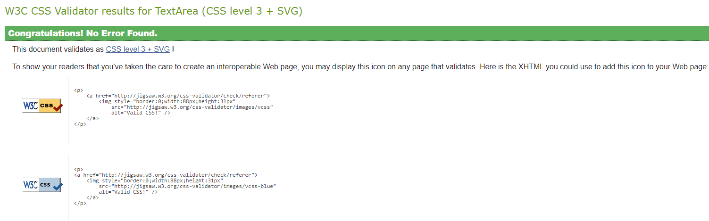
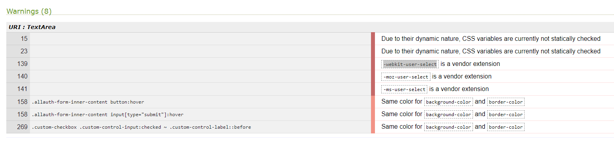

# Testing

For this project, I started with Test Driven Development (TDD), writing tests before coding. Later, I switched to manual testing, which allowed me to find issues and improve usability that automated tests might miss. This also made it easier to adapt to changes and get quick feedback on the user experience. By using both TDD and manual testing, I ensured the application was well-tested and user-friendly.

## Validation

### WSC - Markup Validation Service

#### Homepage (including base and navigation)

[Check Validation Here](https://validator.w3.org/nu/?doc=https%3A%2F%2Fgrapes-of-passion-37a9373e50d5.herokuapp.com%2F) 

-   Some errors and warnings were displayed, which have all be corrected These are listed below:

| Warning/Error                                                             | Corrected by                                                                                 |
| ------------------------------------------------------------------------- | -------------------------------------------------------------------------------------------- |
| Error: Element `li` not allowed as child of element `nav` in this context | Wrapping `<li>` elements inside `<ul>` elements.                                             |
| Error: Duplicate ID `user-options`                                        | Changed IDs to `user-options-desktop` and `user-options-mobile` to ensure uniqueness.        |
| Error: End tag `div` seen, but there were open elements                   | Ensured all opening tags have corresponding and properly nested closing tags.                |
| Error: Unclosed element `ul`                                              | Ensured all `<ul>` elements are properly closed.                                             |
| Error: No `li` element in scope but a `li` end tag seen                   | Ensured all `<li>` elements are properly nested within `<ul>`, `<ol>`, or `<menu>` elements. |
| Error: Stray end tag `ul`                                                 | Ensured all end tags match their corresponding opening tags.                                 |
| Error: Stray end tag `nav`                                                | Ensured all `<nav>` tags are properly opened and closed.                                     |
| Error: Stray end tag `div`                                                | Ensured all `
` tags are properly opened and closed.                                     |
| Error: Stray end tag `header`                                             | Ensured all `<header>` tags are properly opened and closed.                                  |
| Warning: The first occurrence of ID `user-options` was here               | Changed IDs to ensure each ID is unique within the document.                                 |
| Warning: The type attribute is unnecessary for JavaScript resources       | Removed the `type="text/javascript"` attribute from the `<script>` tags.                     |

#### Basket page

[Check Validation Here](https://validator.w3.org/nu/?doc=https%3A%2F%2Fgrapes-of-passion-37a9373e50d5.herokuapp.com%2Fbasket%2F)

-   One warning was displayed, which has been corrected. These are listed below:

| Warning/Error                                                             | Corrected by                                    |
| ------------------------------------------------------------------------- | ----------------------------------------------- |
| Error: Element `li` not allowed as child of element `nav` in this context | Wrapped `<li>` elements inside `<ul>` elements. |

#### Checkout page (including checkout success)

[Check Validation Here](https://validator.w3.org/nu/?doc=https%3A%2F%2Fgrapes-of-passion-37a9373e50d5.herokuapp.com%2Fcheckout%2F)

-   One error displayed, which has been corrected. Listed below:

| Warning/Error                                                          | Corrected by                                                                                                                                              |
| ---------------------------------------------------------------------- | --------------------------------------------------------------------------------------------------------------------------------------------------------- |
| Warning: The `type` attribute is unnecessary for JavaScript resources. | Removed the `type="text/javascript"` attribute from the `<script>` tags. Noticed this was a recurring issue, so i have removed this from all other files. |

#### Products page (including checkout success)

[Check Validation Here](https://validator.w3.org/nu/?doc=https%3A%2F%2Fgrapes-of-passion-37a9373e50d5.herokuapp.com%2Fproducts%2F)

-   One error displayed, which has been corrected. Listed below:

| Warning/Error                                             | Corrected by                                                                  |
| --------------------------------------------------------- | ----------------------------------------------------------------------------- |
| Error: The `strike` element is obsolete. Use CSS instead. | Replaced the `<strike>` elements with CSS styling to achieve the same effect. |

#### Product detail page

[Check Validation Here](https://validator.w3.org/nu/?doc=https%3A%2F%2Fgrapes-of-passion-37a9373e50d5.herokuapp.com%2Fproducts%2F2%2F) 

-   No errors or warnings displayed.

#### Edit product page

[Check Validation Here](https://validator.w3.org/nu/?doc=https%3A%2F%2Fgrapes-of-passion-37a9373e50d5.herokuapp.com%2Fproducts%2Fedit%2F5%2F)

-   No errors or warnings displayed.

#### Add product page

[Check Validation Here](https://validator.w3.org/nu/?doc=https%3A%2F%2Fgrapes-of-passion-37a9373e50d5.herokuapp.com%2Fproducts%2Fadd%2F)

-   No errors or warnings displayed.

#### Profile page

[Check Validation Here](https://validator.w3.org/nu/?doc=https%3A%2F%2Fgrapes-of-passion-37a9373e50d5.herokuapp.com%2Fprofile%2F)

-   No errors or warnings displayed.

#### Register page

[Check Validation Here](https://validator.w3.org/nu/?doc=https%3A%2F%2Fgrapes-of-passion-37a9373e50d5.herokuapp.com%2Faccounts%2Fsignup%2F)

-   No errors or warnings displayed.

#### Login page

[Check Validation Here](https://validator.w3.org/nu/?doc=https%3A%2F%2Fgrapes-of-passion-37a9373e50d5.herokuapp.com%2Faccounts%2Flogin%2F)

-   No errors or warnings displayed.

#### Logout page

[Check Validation Here](https://validator.w3.org/nu/?doc=https%3A%2F%2Fgrapes-of-passion-37a9373e50d5.herokuapp.com%2Faccounts%2Flogout%2F)

-   No errors or warnings displayed.

#### Wine Tasting page

[Check Validation Here](https://validator.w3.org/nu/?doc=https%3A%2F%2Fgrapes-of-passion-37a9373e50d5.herokuapp.com%2Fwine_tasting%2F)

-   No errors or warnings displayed.

### WSC - CSS Validation Service

I have entered my external css file into the validator:

-   No errors found.
-   Some warnings have appeared in relation to using variables for the colours/fonts, using vendor extensions and setting the same colour for border and background. I have left these in as they were all taught in codeinstitute lessons.

### JSLint

A large amount of the functionality comes from script within the boutique_ado project. I have validated the additional js script/logic I have added as below:

#### Wine Tasting script

-   A few warnings/errors displayed, which have been corrected except one. Listed below:

| Warning/Error                              | Corrected by                                                                                                                                                                          |
| ------------------------------------------ | ------------------------------------------------------------------------------------------------------------------------------------------------------------------------------------- |
| Line is longer than 80 characters          | Split long lines into shorter ones                                                                                                                                                    |
| Use double quotes, not single quotes       | Changing the highlighted single quotes to double quotes                                                                                                                               |
| Expected an identifier and instead saw `{` | Not corrected, unsure why `const dates = {{ dates_json  \| safe }};` is flagging as the function works as expected, do not want to cause this to change so I have left this as it is. |

### CI Python Lynter

I have run each of my Python files through the linter, there were quite a few changes to make to most files in order for these to pass, all have been corrected now. The warnings that appeared throughout are listed below:

| Warning                                 | Corrected by                                                               |
| --------------------------------------- | -------------------------------------------------------------------------- |
| Lines over 80 characters                | Splitting into 2 or more lines, often including strings within parenthesis |
| Continuation line under indented        | Adjusting the indentation                                                  |
| Continuation line over indented         | Adjusting the indentation                                                  |
| Variables declared but never used       | Removing these where appropriate                                           |
| Handler404 has already been declared    | Removing import of handler404 as had a custom declaration for this         |
| Expected 2 blank lines, found 1         | Adding an additional line where appropriate                                |
| No newline at end of file               | Adding the newline at the end of the file                                  |
| Various Django imports that were unused | Removing these as unnecessary                                              |
| Do not use bare except                  | Importing Http404 to include after the except clause                       |
| Too many blank lines                    | Reducing the amount of blank lines                                         |

## Manual Testing

### General

| Test                                         | Expected                                                                           | Result |
| -------------------------------------------- | ---------------------------------------------------------------------------------- | ------ |
| Responsive on all devices                    | The website layout adjusts as expected across mobile, tablet, and desktop devices. | Pass   |
| Toasts for alerts, errors, successes         | Toast messages appear for alerts, errors, and successes.                           | Pass   |
| Toasts for product information in the basket | Toast messages display information about products in the basket.                   | Pass   |

### All Pages

| Test                                                                                                | Expected                                                                                          | Result |
| --------------------------------------------------------------------------------------------------- | ------------------------------------------------------------------------------------------------- | ------ |
| Navbar - Logo click                                                                                 | Clicking the logo reloads the home page.                                                          | Pass   |
| Navbar - Search bar                                                                                 | Search bar collapses into an icon on small devices and expands out when the icon is clicked.      | Pass   |
| Navbar - Search bar functions and products relevant to the query are displayed in the products page | Search bar functions and collapses into an icon on small devices.                                 | Pass   |
| Navbar - My Account dropdown                                                                        | Dropdown shows correct options based on user login status.                                        | Pass   |
| Navbar - Basket icon                                                                                | Basket icon displays total price of items.                                                        | Pass   |
| Main Navigation - Category links                                                                    | Clicking categories/subcategories navigates to correct sections/pages.                            | Pass   |
| Banner - Free delivery criteria                                                                     | Banner displays free delivery criteria correctly.                                                 | Pass   |
| Footer - Social media links                                                                         | Social media links direct to the appropriate pages on a separate tab.                             | Pass   |
| Footer - Location link                                                                              | Location link directs to the appropriate Google map location on a separate tab.                   | Pass   |
| Footer - Company information, logo and copyright                                                    | Company name, address, contact number, email, logo, copyright info and Google link are displayed. | Pass   |
| Footer - Navigation categories                                                                      | Navigation categories direct to the intended pages.                                               | Pass   |

### Homepage

| Test                      | Expected                                                                                                                                                                                              | Result |
| ------------------------- | ----------------------------------------------------------------------------------------------------------------------------------------------------------------------------------------------------- | ------ |
| Background image          | Background image takes up full width with company name and 'Scroll to Explore' message is displayed.                                                                                                  | Pass   |
| Recommended wines section | Displays 4 bottles of wine with images, product names, and prices, clicking on these directs to the product details page for that image. Also, the number of products displayed reduces when scaling. | Pass   |
| Wine tasting section      | Displays an image, welcoming message, and 'Discover More' button which links to the wine tasting page.                                                                                                | Pass   |
| Offers section            | Displays a grid of 3 images of available offers. The number of offers displayed reduces when scaling.                                                                                                 | Pass   |

### Product/Query Page

| Test                                     | Expected                                                                                                                                                                                                                                                           | Result |
| ---------------------------------------- | ------------------------------------------------------------------------------------------------------------------------------------------------------------------------------------------------------------------------------------------------------------------ | ------ |
| Title and paragraph                      | Title and paragraph showing the number of results and 'View All Products' links to all products within the product page.                                                                                                                                           | Pass   |
| Sort button                              | Sort button sorts by price, discount, name, and category (ascending and descending).                                                                                                                                                                               | Pass   |
| Products grid display                    | Products are displayed with images, prices, and open product details on click.                                                                                                                                                                                     | Pass   |
| Back to top button                       | Button directs the user back to the top of the page.                                                                                                                                                                                                               | Pass   |
| Product edit function (Superuser only)   | Link should be displayed, when clicked this directs them to the edit product page where they can edit that particular product. This should not be available if not a superuser.                                                                                    | Pass   |
| Product delete function (Superuser only) | Link should be displayed, when clicked this pops up with a modal asking user to confirm if they want to delete the product (yes or no buttons), product is deleted if yes, modal is closed with no deletion made. This should not be available if not a superuser. | Pass   |

### Product Details Page

| Test                         | Expected                                                                     | Result                                                                                                  |
| ---------------------------- | ---------------------------------------------------------------------------- | ------------------------------------------------------------------------------------------------------- |
| Larger product image         | Larger product image is displayed correctly.                                 | Pass                                                                                                    |
| Product name and details     | Product name, grape, country, description, and price are displayed.          | Pass                                                                                                    |
| Price and quantity selection | Quantity selection functionality works correctly.                            | Fail - It does, however, there hasn’t been any functionality built in to adjust the price on this page. |
| Add to basket button         | Adds selected product to the basket.                                         | Pass                                                                                                    |
| More details section         | Displays detailed product information and clicking link returns to products. | Pass                                                                                                    |

### Wine Tasting Page

| Test                                | Expected                                                                                     | Result |
| ----------------------------------- | -------------------------------------------------------------------------------------------- | ------ |
| Title                               | Page title is displayed.                                                                     | Pass   |
| Wine tasting products are displayed | Displays wine tasting experience titles, descriptions, and images.                           | Pass   |
| Form for booking                    | Form fields (experience, contact number, requirements, datepicker, quantity) are functional. | Pass   |
| Price and total price               | Price per person and total price update correctly.                                           | Pass   |
| Confirm Reservation button          | Redirects to login if not logged in and confirms booking if logged in.                       | Pass   |

### Basket Page

| Test                            | Expected                                                                                                                                                           | Result                                                                             |
| ------------------------------- | ------------------------------------------------------------------------------------------------------------------------------------------------------------------ | ---------------------------------------------------------------------------------- |
| Page title                      | Page title 'Basket' is displayed.                                                                                                                                  | Pass                                                                               |
| Basket products display         | Displays products with image, name, individual price, and total price.                                                                                             | Pass                                                                               |
| Update quantity/remove product  | Functionality to update quantity or remove a product works correctly.                                                                                              | Pass                                                                               |
| Basket total display/updating   | Displays correct basket total, delivery costs, and grand total.                                                                                                    | Pass                                                                               |
| Offer - 5 bottles of wine for 4 | For every multiple of 5 bottles of wine in the basket, the cheapest item(s) should be deducted from the basket and grand total then a discounted figure displayed. | Pass                                                                               |
| Offer - Other 2 offers          | Discounts should be applied appropriately to the other offers that are available.                                                                                  | Fail - the functionality has not been implemented for those to discount the price. |
| Free delivery message           | Message about free delivery criteria displays correctly.                                                                                                           | Pass                                                                               |
| Proceed to checkout button      | Button directs the user to secure checkout.                                                                                                                        | Pass                                                                               |

### Checkout Page

| Test                                            | Expected                                                                                                                                            | Result |
| ----------------------------------------------- | --------------------------------------------------------------------------------------------------------------------------------------------------- | ------ |
| Page title                                      | Page title 'Checkout' is displayed.                                                                                                                 | Pass   |
| Form for user details                           | Form fields for name, email, delivery address, and card details are functional.                                                                     | Pass   |
| Order summary display                           | Displays products, product name, image, quantity, and subtotal correctly.                                                                           | Pass   |
| Complete Order button                           | Triggers Stripe payment process.                                                                                                                    | Pass   |
| Adjust Basket button                            | Returns user to the basket page.                                                                                                                    | Pass   |
| Payment processing - Initial payment processing | Displays loading overlay, confirmation appears whether successful or failure.                                                                       | Pass   |
| Stripe Webhook                                  | Displays correct information about the processed payment, including payment_intent creation/whether successful + charge updated/whether successful. | Pass   |

### Register Page

| Test                  | Expected                                                                                       | Result |
| --------------------- | ---------------------------------------------------------------------------------------------- | ------ |
| Page title            | Page title 'Register' is displayed.                                                            | Pass   |
| Login message         | Message directing user to login if they already have an account is displayed, link works also. | Pass   |
| Form for registration | Form fields for email, confirm email, username, password, confirm password are functional.     | Pass   |
| Register button       | Completes registration process.                                                                | Pass   |
| Back to Login button  | Directs user back to login.                                                                    | Pass   |

### Sign In Page

| Test                           | Expected                                                                                                  | Result |
| ------------------------------ | --------------------------------------------------------------------------------------------------------- | ------ |
| Page title                     | Page title 'Sign in' is displayed.                                                                        | Pass   |
| Sign up message                | Message directing user to 'Sign up' if they do not already have an account is displayed, link works also. | Pass   |
| Form for sign in               | Form fields for username/email and password are functional.                                               | Pass   |
| Remember Me checkbox           | Checkbox remembers user's details.                                                                        | Pass   |
| Sign in button                 | Signs the user in.                                                                                        | Pass   |
| Home button                    | Returns user to Home page.                                                                                | Pass   |
| Forgot password link           | Directs user to 'Forgot password' page.                                                                   | Pass   |
| Forgot password email received | Forgotten password email link is received.                                                                | Fail   |

### Profile Page

| Test                                 | Expected                                                                   | Result |
| ------------------------------------ | -------------------------------------------------------------------------- | ------ |
| Page title                           | Page title 'My Profile' is displayed.                                      | Pass   |
| Default Delivery Information section | Form to add and update default delivery information is functional.         | Pass   |
| Order History section                | Displays order history with order no, date, total, and items.              | Pass   |
| Order no link                        | Directs user to previous order confirmation.                               | Pass   |
| Wine Tasting Bookings section        | Displays bookings with experience name, date, number of guests, and price. | Pass   |

### Product Management Page

| Test                            | Expected                                                                                                                                  | Result |
| ------------------------------- | ----------------------------------------------------------------------------------------------------------------------------------------- | ------ |
| Page title                      | Page title 'Product Management' is displayed.                                                                                             | Pass   |
| Form for product management     | Form fields for product details (category, sku, name, etc.) are functional.                                                               | Pass   |
| Checkboxes for vegan/vegetarian | Checkboxes for vegan/vegetarian work correctly.                                                                                           | Pass   |
| Add/Edit product button         | Appropriate button (Add product/edit product) is displayed depending on whether adding or deleting a product. These function as expected. | Pass   |
| Cancel button                   | Reverts back to the products page without making any changes.                                                                             | Pass   |

### 404 Page

| Test                  | Expected                                           | Result |
| --------------------- | -------------------------------------------------- | ------ |
| Message display       | Displays message ‘Sorry, this page doesn’t exist’. | Pass   |
| Error image           | Displays the 404 error image correctly.            | Pass   |
| Home page link/button | Link/Button directs the user to the home page.     | Pass   |

## Testing User Stories

#### _Viewing/Navigation and Searching_

| #   | As a User/Shopper I want to be able to...                 | Result                                                                                  |
| --- | --------------------------------------------------------- | --------------------------------------------------------------------------------------- |
| 1   | Navigate around the site by scrolling.                    | Pass                                                                                    |
| 2   | Navigate through categories and subcategories.            | Pass                                                                                    |
| 3   | View products.                                            | Pass                                                                                    |
| 4   | View available offers.                                    | Fail - As only one of the offers that is on display is actually available currently.    |
| 5   | Search for specific queries relating to products.         | Pass                                                                                    |
| 6   | View imagery and relevant information about each product. | Pass                                                                                    |
| 7   | See the total amount of products in my basket.            | Pass                                                                                    |
| 8   | Filter to refine results for product/query.               | Fail - As this functionality has not been implemented due to deadline/time constraints. |
| 9   | Sort products depending on preference.                    | Pass                                                                                    |
| 10  | View contact information and social media links.          | Pass                                                                                    |
| 11  | Book dates for events and specify any requirements.       | Pass                                                                                    |

#### _Checkout/Payment Processing_

| #   | As a User/Shopper I want to be able to...                                 | Result                                                                        |
| --- | ------------------------------------------------------------------------- | ----------------------------------------------------------------------------- |
| 12  | View the grand total and list of the products to check before purchasing. | Pass                                                                          |
| 13  | Remove/or adjust quantity of items in the basket.                         | Pass                                                                          |
| 14  | Trust my personal and payment information kept secret and secure.         | Pass                                                                          |
| 15  | Receive an email confirmation if checkout is successful.                  | Fail - This functionality is not currently operational as no emails are sent. |

#### _Managing Accounts_

| #   | As a User/Shopper I want to be able to...       | Result                                                                        |
| --- | ----------------------------------------------- | ----------------------------------------------------------------------------- |
| 16  | Register for an account.                        | Pass                                                                          |
| 17  | Receive an email confirmation.                  | Pass                                                                          |
| 18  | Login and logout of my account.                 | Pass                                                                          |
| 19  | Recover password if forgotten.                  | Fail - This functionality is not currently operational as no emails are sent. |
| 20  | Add default delivery information in my profile. | Pass                                                                          |
| 21  | View my order history.                          | Pass                                                                          |

#### _Site Owners/Admins_

| #   | As a Site Owner/Admin I want to be able to...                                 | Result |
| --- | ----------------------------------------------------------------------------- | ------ |
| 22  | Create products to including relevant details to be stored within a database. | Pass   |
| 23  | View products displayed throughout the site.                                  | Pass   |
| 24  | Manage these products so I can update and delete.                             | Pass   |
| 25  | View a warning if deleting an item to prevent accidental deletions.           | Pass   |

## Other Testing

Google Developer tools:

-   I have continuously tested and played around with many different resolutions throughout developement, to ensure there is no unexpected behaviour.

Testing on other browsers:

-   Google Chrome.
-   Microsoft Edge.
-   Firefox.

Devices:

-   Google Pixel.
-   Samsung S10.
-   Dell Inspiron (Windows 11).
-   Lenovo laptop

Other users:

-   My partner Laura Gibbons has tested the site herself on different browsers on her Google Pixel.

Future Test Needed:

Unfortunately I have not been able to test on any mac software/hardware due to hardware issue, this will need to be completed in the future

## Bugs

| Bug                                                                                                                                                                                                                                            | Fixed By                                                                                                                                                                                  |
| ---------------------------------------------------------------------------------------------------------------------------------------------------------------------------------------------------------------------------------------------- | ----------------------------------------------------------------------------------------------------------------------------------------------------------------------------------------- |
|                                                                                                                                                                                                                                                |
| All products started displaying various different for loops and if statements with Django templating. Couldn't quite get it to work as intended when passing grouped values.                                                                   | Placing the sorting logic within the view instead and assigning the intended values to a variable called display_title. This would be the variable that is now displayed in the template. |
| 'Remove' was not deleting items from the shopping basket; it displayed a 500 error confirming the post URL doesn't end with a slash. I had tried manually adding one in the view and in the template, however, this didn’t work.               | Including append_slash=True in settings.                                                                                                                                                  |
| When styling the update and remove buttons within the basket page, I wanted these to appear below the quantity controls. The update functionality stopped working when I moved it inside of the form; I was trying to get the optimal styling. | Changing `let form = $(this).prev('.update-form');` to `let form = $(this).closest('.update-form');`                                                                                      |
| Accidentally deleted a product, loaded fixtures to restore the product as there was no warning implemented.                                                                                                                                    | Managed to recover the product by loading product data to the DB again, and implemented a check for future situations.                                                                    |
| `TemplateSyntaxError: Invalid filter: 'as_crispy_field'`. Double-checked the code as I managed to get this to work previously with the Boutique_ado project, although a slightly different version of crispy forms at the time.                | After researching online, I discovered an article on Stack Overflow that indicated `` should be included. Adding this fixed the error.                        |
| Got a toast error displaying when I should be getting an toast alert for the particular function.                                                                                                                                              | Correcting using the toast_info template as I had accidentally included the syntax for the toast_error template instead.                                                                  |
| "5 bottles Deal" wasn't displaying the correct amount in a few pages within the site, and the order displayed the amount prior to the discount.                                                                                                | Ensuring that the total in the context function represents the sum of all items before any discounts, and the grand_total includes the discount and delivery cost correctly.              |
| Noticed product discount wasn’t the price that was carried through the basket, checkout, or stripe.                                                                                                                                            | Started fix by amending the discounted price to the original price.                                                                                                                       |
| Received an error after the above change as I couldn't migrate while there was still mention of discount_price within the project.                                                                                                             | Made sure naming was corrected where necessary. Updated fixtures then loaded them to the DB.                                                                                              |
| With the recommended products displayed on the homepage, I realized that if I delete one of the specified products for the recommended section, this will cause an error.                                                                      | Added failsafe logic to ensure that if that product (by PK) doesn't exist, it will be replaced by another random product.                                                                 |
| I needed to add a user to the WineTastingBooking model, however, this would not allow me to proceed without a default user.                                                                                                                    | Adding default=1 to specify the default user to allow the migration to take place.                                                                                                        |
| With the site on the local server, everything was working as intended. However, the deployed site (that was previously working fine) was displaying a 500 error and I was unable to view the site at all.                                      | Migrating to Heroku specifically. I thought these updated each time the usual migrate was run but that isn’t the case.                                                                    |
| For some reason, when I tried to link a CSS file within the wine_tasting static folder, this was causing the datepicker to malfunction and display very abnormally.                                                                            | Adding the wine_tasting CSS to the base file, which worked fine.                                                                                                                          |
| On the deployed site, the wine tasting booking form was not displaying any options for the user. I realized this was because I had manually entered the products into Django admin locally.                                                    | Fixed issue by creating a fixtures file, committing this, then loading the data in the deployed database.                                                                                 |

### Unresolved Bugs

##### Verification emails:

The verification email process works correctly in development, where I can see the template confirming verification is needed and the email is printed to the console, allowing verification through the printed URL. However, in production, this process fails. Users are signed up and confirmed without verification. Despite my research online, I was unable to find a solution. Due to time constraints, I will address this issue in the future.
Font Issue with Playfair Display:

##### Font Changing Unintentionally:

The Playfair Display font on the banner is not consistently displaying on some pages, reverting to the default font instead. This is peculiar since the banner is part of a template accessible to all pages. Due to time constraints, I will correct this issue in the future.
Date Field Issue in Wine Tasting Booking Form:

##### Form Submission Prevention:

The 'required' attribute on the date fields in the wine tasting booking form is not preventing form submission without a date. I tried to implement logic within JavaScript, but I was unsuccessful, possibly due to a quirk with the Flatpickr datepicker I am using. Due to time constraints, I will correct this issue in the future.
